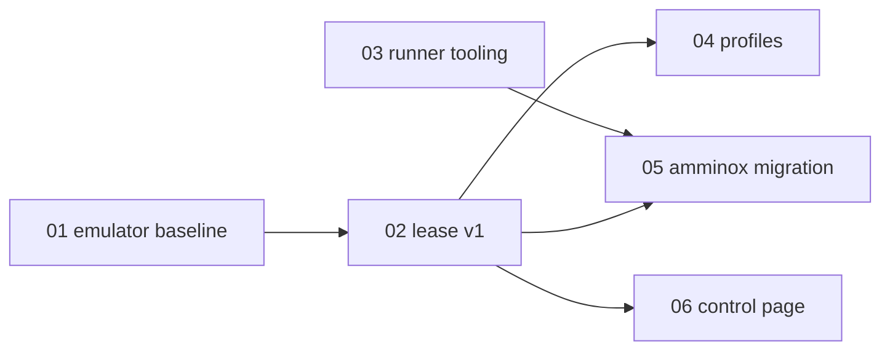

# Android Testing Initiative: Overview

Status: IN-PROGRESS (planning complete 2026-09-28)

## Goal

Set up a **shared** Android emulator, owned by `labs-infra` rather than any single product repo, that an agent can drive to replicate user workflows within the network and policy limits of the environment. Product feature work (e.g. Carte shopping integration) is out of scope for this initiative.

## Decisions (binding for all tasks)

1. **Emulators belong to `labs-infra/android-emulator/`.** Product repos own only their app builds and Maestro flows. The amminox-owned emulator manifests (`amminox/deploy/android-emulator*.yaml`, `amminox/client/k8s/emulator-*.yaml`, `amminox/k8s/mvp9/emulator-*.yaml`) and the running `dev/amminox-android-emulator` + NodePort `30185` are retired (task 05).
2. **QEMU emulator, not Redroid.** The labs-infra examples use `redroid/redroid`, but the K3s host kernel lacks binder/ashmem (recorded in `amminox/docs/MVP9-BACKLOG.md`). Use the Android SDK emulator image (`ghcr.io/cirruslabs/android-sdk:34`-based) with `/dev/kvm`.
3. **ADB is ClusterIP-only in the `ci` namespace.** No NodePort, no ingress. Consumers are in-cluster: the self-hosted runner, the isolated HTTPS control app (debug-only key and debug-lease selector), or an operator on an authorized lab machine using `kubectl port-forward`.
4. **Regression runs go through CI on the self-hosted runner.** The corporate laptop pushes a branch or dispatches a workflow, the runner leases an emulator and runs Maestro, and artifacts (screenshots, UI hierarchy, reports) are downloaded with `gh run download`. Interactive debugging from the corporate laptop uses the HTTPS control page (task 06); the proxy blocks WebSockets, so it is request/response only.
5. **Leases v1 are a kubectl-driven script/composite action run by the runner**, implementing the labs-infra lease contract (create PVC + Deployment + Service from a profile, delete on release). The HTTP allocator (`POST/GET/DELETE /leases`) in the labs-infra README is deferred until more than one consumer needs concurrent leases (YAGNI). Record this in the labs-infra README when task 02 lands.

## Environment limits (read before any task)

- `.github/learnings/2026-09-28-corporate-workstation-network-limits.md`: the corporate laptop gets WSAEACCES 10013 on LAN ports, `kubectl exec`/`port-forward` fail through Rancher, and the AI URL category is filtered. **Do not retry or tunnel.**
- `.github/learnings/2026-09-28-amminox-android-emulator-first-pass.md`: emulator spec, ADB loopback-only root cause, and in-cluster probe-pod technique.
- Hard rules: `.github/instructions/hard-rules.instructions.md` (self-hosted runner only; PR + CI; probes and resource limits on every container; secrets via `kubectl create secret --dry-run=client | apply`).
- labs-infra R5: every cluster change ships through labs-infra PR + CI. Manual `kubectl apply` only for break-glass, back-ported the same session.

## Tasks

| # | Task | Repo | Depends on | Status |
|---|---|---|---|---|
| 01 | [Shared emulator baseline](01-shared-emulator-baseline.md) | labs-infra | none | IN-PROGRESS |
| 02 | [Lease script + composite action](02-lease-v1.md) | labs-infra | 01 | IN-PROGRESS |
| 03 | [Runner Android tooling](03-runner-android-tooling.md) | labs-infra | none (parallel with 01) | IN-PROGRESS |
| 04 | [Profile enrollment (clean, walmart-authenticated)](04-profile-enrollment.md) | labs-infra | 01, 02 | IN-PROGRESS (operator step pending) |
| 05 | [amminox native E2E migration + retire product emulator](05-amminox-native-e2e-migration.md) | amminox | 02, 03 | IN-PROGRESS |
| 06 | [Emulator control page (HTTPS viewer + control API)](06-emulator-control-page.md) | labs-infra | 01, 02 | IMPLEMENTED ON FEATURE BRANCH (CI/OAuth pending) |

Done when: a `workflow_dispatch` run of an amminox Maestro flow leases a shared emulator, drives the app, and publishes screenshots as artifacts.

## Open questions for the user

- GitHub org drift: hard rules say `ethanimproving`, but labs-infra CI publishes to `ghcr.io/millernest-home-labs/...`. Confirm the canonical org before adding new images.
- Rotate the LAN kubeconfig token (shared in chat on 2026-09-28).