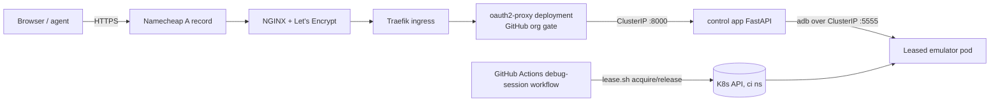

# 06: Emulator control page (HTTPS viewer + control API)

Status: DEPLOYED (2026-09-30; PR #18 merged; OAuth app/Secret configured; health and OAuth redirect verified)
Owner repo: `labs-infra` (branches `feature/emulator-control-service`, `feature/emulator-control-deploy`)
Depends on: 01, 02
Skills: `backend-implementation`, `k3s-kubectl-commands`, `github-cli-operations`, `qa-verification`

## Goal

An agent (via browser tools or `curl`) and the operator (via a browser) can drive a disposable shared emulator in near-real time from the corporate laptop, using **plain HTTPS only**, so native flows can be debugged step by step instead of through 12-20 minute runner cycles.

## Why this shape (constraints verified 2026-09-29)

- The corporate proxy returns 403 on **every** WebSocket handshake (public echo services and `rancher.millernest.com` alike), and `kubectl exec`/`port-forward` fail with `Upgrade request required`. ws-scrcpy, scrcpy, VNC-over-WebSocket, and exec-based pods are therefore out.
- VPN (WireGuard, Tailscale) from the corporate laptop is against policy.
- Plain HTTPS to `*.millernest.com` works (`amminox.millernest.com` loads in the browser).
- So: request/response HTTP only. The screen is a polled PNG; input is discrete POSTs. This is an application-specific tool, **not** a tunnel. Raw ADB never leaves the cluster.

## Architecture



- **Location:** `labs-infra/android-emulator/control/`. It is part of the shared pool; not a new repo.
- **Pods:** separate Deployments in `ci`:
  - `emulator-control-auth`: oauth2-proxy (`quay.io/oauth2-proxy/oauth2-proxy`, pinned), GitHub provider, `--github-org=Millernest-Home-Labs`, secure HttpOnly cookie, health-route bypass, upstream `http://emulator-control.ci.svc.cluster.local:8000`, passes `X-Forwarded-User`. This pod holds OAuth secrets and GitHub HTTPS egress.
  - `emulator-control`: FastAPI with ADB, reachable only from the auth pod on port 8000. It has a debug-only ADB key, no Kubernetes token, no `kubectl`, and no GitHub credential or public ingress.
- **Lease ownership:** a manually dispatched `android-emulator-debug.yml` workflow uses the existing runner and lease script to acquire a clean debug lease, holds it for at most 60 minutes, and releases it when cancelled/completed. Trusted CI owns privileged pod creation; the public web app does not.
- **Viewer ownership:** the workflow projects its `GITHUB_ACTOR` into `ci/android-debug-session`; only the matching `X-Forwarded-User` may access screenshots or device actions. Other authenticated org members see only `state: busy` with no screen dimensions.
- **Viewer ownership:** the debug workflow writes its triggering GitHub username to ConfigMap `ci/android-debug-session`. The control app receives that ConfigMap as an optional read-only volume (no Kubernetes token); only the matching `X-Forwarded-User` can view or control the device. The workflow deletes the ConfigMap on cleanup.
- **Stable ADB target:** debug leases carry `android.millernest.com/debug-session=true`; a static ClusterIP Service `android-debug-emulator` selects only that label. The control app connects to `android-debug-emulator.ci.svc.cluster.local:5555`. Normal CI leases are not selected or controllable by the page.
- **Network:** app ingress admits only the auth pod; app egress admits only DNS and debug emulator ADB. Auth ingress admits only Traefik; auth egress admits DNS, the app, and HTTPS for GitHub OAuth. The app's `android.millernest.com/adb-client=true` label is admitted by the existing emulator ADB policy.
- **Web app privilege:** no Kubernetes ServiceAccount token (`automountServiceAccountToken: false`), no `kubectl`, and no Kubernetes API client/RBAC. It mounts only a separate debug-only ADB key as a Secret; that key is trusted only by debug leases, never by CI leases. A compromised web app can control the active disposable debug emulator, but cannot create pods, read other cluster Secrets, or manage leases.

## API contract (v1, all JSON unless noted; OpenAPI at `/api/v1/openapi.json`)

All session and device routes in the table are prefixed with `/api/v1` (for example, `POST /api/v1/session`). Operational endpoints remain at the root for Kubernetes probes: `/health`, `/health/liveness`, and `/health/readiness`. Every response includes `X-Correlation-ID`; callers may provide a UUID in that request header, otherwise the service generates one. OpenAPI uses the OAuth 2.0 authorization-code flow for GitHub sign-in via oauth2-proxy and documents that browser API calls are authorized by the resulting secure proxy session cookie.

Every non-health route requires the oauth2-proxy session. State-changing routes require the exact browser `Origin` plus their documented JSON or APK media type; cross-origin requests fail the origin check and browsers cannot send the custom APK media type without a CORS preflight (CORS is not enabled).

| Method | Path | Request | Response | Errors |
|---|---|---|---|---|
| GET | `/health` | none | `{"status":"ok"}` | none |
| GET | `/health/liveness` | none | `{"status":"alive"}` | none |
| GET | `/health/readiness` | none | `{"status":"ready"}` when ADB binary and debug key are available | 503 |
| GET | `/` | none | viewer HTML | none |
| GET | `/session` | none | `{"state":"none"\|"busy"\|"starting"\|"ready","viewer","screen":{"width","height"}}` | none |
| GET | `/screen.png` | none | `image/png` | 409 no ready session |
| POST | `/input/tap` | `{"x":int,"y":int}` device px, within screen | 204 | 422 out of bounds |
| POST | `/input/swipe` | `{"x1","y1","x2","y2","durationMs"}` (50-3000) | 204 | 422 |
| POST | `/input/text` | `{"text":str}` 1-500 chars, printable | 204 | 422 |
| POST | `/input/key` | `{"key":"BACK"\|"HOME"\|"ENTER"\|"TAB"\|"DEL"\|"APP_SWITCH"}` | 204 | 422 |
| POST | `/app/launch` | `{"package":str}` regex `^[A-Za-z0-9_]+(\.[A-Za-z0-9_]+)+$` | 204 | 404 not installed |
| PUT | `/app/install` | raw APK bytes, `Content-Type: application/vnd.android.package-archive`, max 300 MiB | 204 | 413 too large, 422 not a valid APK |
| GET | `/ui` | debug-session owner | `{"nodes":[{"text","resourceId","contentDesc","class","bounds":[x1,y1,x2,y2],"clickable","enabled"}]}` | 403 not owner, 409 no lease |
| GET | `/logcat?package=&lines=` | debug-session owner, package required, lines 1-500 | `text/plain` filtered for sensitive lines and limited to that app's PID | 403 not owner, 404 app not running |

Error shape: `{"error":{"code":"SNAKE_CASE","message":str}}`.

### Session rules

- One debug session at a time, started with a manually dispatched GitHub Actions workflow. The user who dispatched the active run is the only org member allowed to view or control its device. Profile is always `clean`; retailer profiles and credentials are never available here.
- Workflow hard limit is 60 minutes; cancellation releases the lease, and the existing 90-minute reaper is the backstop. The web app has no lease-management API.
- Shares `max-leases` with CI. A debug session blocks CI native E2E while active (and vice versa); the lease script's existing capacity wait applies.

### Input safety (must be unit-tested)

- `adb shell` joins arguments into a remote shell string. Every user-derived value is validated (types, bounds, allowlists, regexes above) **and** passed through `shlex.quote` before reaching `adb shell`. `/input/text` encodes spaces as `%s` and escapes shell metacharacters; no raw passthrough route exists.
- `/app/install`: the operator uploads an APK downloaded from an `amminox` native E2E workflow artifact. Enforce a 300 MiB streaming request limit, `AndroidManifest.xml` archive entry, APK media type, and temporary file cleanup. No GitHub PAT is stored in or readable by either control pod.
- UI XML parsed with `defusedxml`.
- Audit log (structlog JSON): user, action, lease, validated parameters, result. Never logs text input verbatim (length only), tokens, or cookies.

## Viewer page

One static HTML + vanilla JavaScript file, no framework, strict CSP (`default-src 'self'`):
- `` of `/screen.png`, refreshed every 1 s while the tab is visible; click maps CSS px to device px and POSTs `/input/tap`; drag becomes `/input/swipe`.
- Controls: open the GitHub debug-session workflow, Back, Home, Enter; text box -> `/input/text`; APK file picker -> `PUT /app/install`; package + Launch; "UI" and "Logcat" panels showing the JSON/text.
- Device state and screen dimensions are visible. GitHub Actions remains the source for lease owner and expiry. Stable selectors are used for browser automation.

## Work items

### PR 1: control service and debug lease workflow - `feature/emulator-control-page`

1. `android-emulator/control/` FastAPI app: layered `app/api` (routes), `app/services` (device actions), `app/infra` (`AdbClient`). Routes never call subprocess directly.
2. Static viewer page.
3. `Dockerfile` (python:3.12-slim + platform-tools + kubectl + `lease.sh`), non-root user.
4. Tests (pytest, sociable): real services and routes via `TestClient`; fake only `AdbClient`. Cover no-lease behavior, input bounds, hostile shell text, UI redaction, invalid APKs, streamed size limits, and audit-log redaction.
5. Playwright test of the viewer against the app running with fake ADB (tap/swipe coordinate mapping and control requests).
6. CI jobs in `.github/workflows/emulator-control.yml` (path filter `android-emulator/control/**` and lease/workflow files): ruff + `mypy --strict`, pytest, image build -> `ghcr.io/millernest-home-labs/labs-infra-emulator-control:<timestamp>.<run>`.
7. `.github/workflows/android-emulator-debug.yml`: manual trigger, acquire `clean` with a debug label/key, hold at most 60 minutes, release under `if: always()`.

### PR 2: deployment - `feature/emulator-control-deploy`

1. `android-emulator/control/kube-deploy/`: app `deployment.yml` (token automount disabled; requests 50m/128Mi and limits 500m/512Mi), auth `proxy.yml` (requests 10m/32Mi and limits 100m/128Mi), ClusterIP Services, HTTPS-host `ingress.yml`, and separate app/auth NetworkPolicies. No ServiceAccount or Role for the app.
2. Deploy job: verify `emulator-control-oauth` exists, ensure the separate debug ADB key through the lease script, apply Services/NetworkPolicies/Deployments, wait with `rollout status --timeout=600s`, roll back deployments on failure, and apply public Ingress only after both deployments are healthy.
3. Update `android-emulator/README.md` (control page section, security rules), overview decisions, and the `android-emulator-testing` skill (agent loop via the page).

## Operator steps (user)

1. **Domain:** operator confirmed `emulator.millernest.com` and Let's Encrypt HTTPS is configured. Verify the host reaches the K3s Traefik entrypoint and Pi-hole resolution after the ingress is deployed. In that NGINX Proxy Manager host's Advanced config, set `client_max_body_size 300m;` so the authenticated APK upload can pass the app's 300 MiB limit.
2. **GitHub OAuth app:** registered as `Millernest Emulator Control` in the `Millernest-Home-Labs` organization. Client ID: `Ov23liKYYWbrL7fdZLyi`. Homepage `https://emulator.millernest.com`; callback `https://emulator.millernest.com/oauth2/callback`; wildcard redirects and Device Flow are disabled. Generate the Client Secret in GitHub and create the K8s Secret yourself; never paste the secret into chat or commit it:
   ```bash
   kubectl -n ci create secret generic emulator-control-oauth \
     --from-literal=client-id=<id> --from-literal=client-secret=<secret> \
    --from-literal=cookie-secret="$(openssl rand -hex 16)" \
     --dry-run=client -o yaml | kubectl apply -f -
   ```
3. Confirm corporate acceptable-use allows browsing to this personal lab tool from the laptop. If the proxy blocks the new hostname as uncategorized, stop; do not route around it.

## Acceptance criteria

1. Unauthenticated request to any route except `/health`, `/health/liveness`, `/health/readiness` redirects to GitHub sign-in; a GitHub user outside the org is denied.
2. From the corporate laptop browser: start the debug workflow, see the home screen within 3 minutes, tap Settings on the screenshot, and see Settings open within 2 s.
3. Upload a valid APK, launch `com.millernest.amminox`, type into the login form, read `/ui` showing the entered field, and read filtered `/logcat`.
4. Hostile input tests pass; no route executes an arbitrary command.
5. Cancelling the debug-session workflow releases its lease; an intentionally orphaned lease is removed by the existing 90-minute reaper.
6. A CI native E2E run during an active debug session fails fast or waits per lease rules; neither corrupts the other.
7. ADB remains ClusterIP-only: no new Service of type NodePort/LoadBalancer, no ingress on 5555/5556.

## Evidence to report

PR links and green CI runs; screenshot of the viewer with Settings open (taken via browser tools from the laptop); `/ui` JSON excerpt; audit log lines for a session (redacted); `kubectl get deploy -l android.millernest.com/role=lease` before/after timeout.

## Do not

- No WebSocket, tunnel, generic TCP/ADB proxy, shell endpoint, or file browser.
- No retailer profiles or credentials through this service.
- Do not expose the app container port outside the pod; all traffic enters via oauth2-proxy.
- The web app must never have Kubernetes API credentials or permissions to create/modify pods, Deployments, Services, or Secrets.
- Do not store the OAuth secret or cookie secret in the repo, GitHub variables, or chat.

## Log
