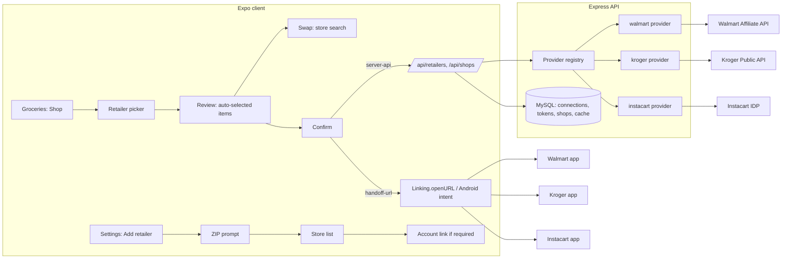
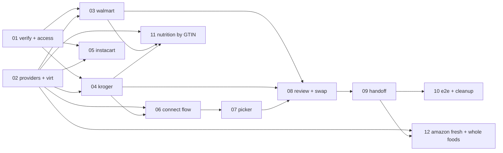

# Carte Shopping Integration: Overview

Status: TODO (planning complete 2026-09-28)
Product repo: `amminox` (Carte). Server `server/` (Node + Express + MySQL, `node --test`), client `client/` (Expo, scheme `amminox`, Android package `com.millernest.amminox`).
Source challenge: `.github/challenges/carte-shopping-integration.md`

## Goal

From the Groceries page, a user taps **Shop**, picks one of the retailers they connected in Settings, reviews a list of store-specific products that the app already chose for them (swapping any item through an in-app search of that store), confirms, and the items land in the retailer's own cart. The retailer's native app (Walmart, Kroger, Instacart) opens with the items in its cart. No retailer web page is embedded in a WebView.

## Research Findings

Labels: **Verified** means confirmed against the vendor's public docs (linked). **Inferred** means the most likely explanation that fits the evidence but has not been observed directly. Task 01 must confirm or refute every Inferred item before later tasks depend on it.

### How MyFitnessPal does it

All 11 challenge screenshots are **MyFitnessPal (iOS)**, not RecipeBox: the "Plan / Meal Planner / Groceries / Recipes" header, and the retailer apps show the iOS back link "< MyFitnessPal".

| # | Screenshot | What it shows |
|---|---|---|
| 1 | `UJ61253` | Groceries -> Shop opens an action sheet: Shop with Instacart / Walmart / Kroger stores / Whole Foods / Amazon Fresh (all partners, not only connected ones) |
| 2 | `RwvQ3cK` | "Select store": "We'll use your location to find local Walmart stores offering pickup or delivery." plus a Zip code search field |
| 3 | `XGL1USO` | ZIP 75098 -> Walmart stores closest first: "Wylie N S State Hwy 78 Supercenter #5210", 0.28 miles; Neighborhood Markets included; name, store number, address, distance, chevron |
| 4 | `hi4RrrO` | "Shop ingredients": selected store card, "Double-check the quantity of each item", line "Tomato - Needs item - + Add", Estimated Total $0.00, disabled "Add to Walmart cart" |
| 5 | `VpWwcb8` | Search "Tomato": native rows with name, size, **store price** (Fresh Roma Tomato, Each $0.16), image, swap icon |
| 6 | `StFrzdo` | Line now has Fresh Roma Tomato, $0.16 each, qty stepper, Swap; Estimated Total $0.16 "excludes tax and delivery charges"; "Add to Walmart cart" |
| 7 | `8N2Fkrg` | **Native Walmart app** Cart ("< MyFitnessPal" back link), 1 item, Pickup at **Dallas W Wheatland Rd Supercenter** (not the Wylie store picked in MFP), tomato at $0.20 (not $0.16) |
| 8 | `JrgyZIo` | "Sign in to Kroger" sheet with an X and **no URL bar**, showing Kroger's hosted Sign In form |
| 9 | `PM4L81q` | Kroger search "Pizza": native rows, promo pricing ($1.67 struck $2.00) |
| 10 | `ikL5hu7` | Kroger "Shop ingredients": store "Kroger - Duncanville", two lines already selected, qty steppers, promo price, Estimated Total $7.98, "Add to Kroger cart" |
| 11 | `ir8LxR1` | **Native Kroger app** Cart ("< MyFitnessPal"), "Pickup Items", Estimated total $7.98, aisle 26 |

Other evidence: MFP Help says Meal Planner (Premium+, US/CA) syncs to **iOS: Instacart, Walmart, Kroger, Amazon Fresh, Whole Foods; Android: Instacart and Walmart** (Verified: [MFP Help, How to use the Meal Planner](https://support.myfitnesspal.com/hc/en-us/articles/34603055097869-How-to-use-the-Meal-Planner)).

Conclusions:

1. **Kroger: official Kroger Public API** (Verified by screenshots 8-11 plus Kroger docs). Kroger-hosted OAuth sign-in, store-scoped product search with regular/promo price (screenshot 9 matches the Products API `price.regular`/`price.promo`), then `PUT /v1/cart/add` with modality `PICKUP` (screenshot 11 shows "Pickup Items" with the same $7.98 total), then MFP opens the Kroger app. The cart is account-level, so the Kroger app shows the items immediately. MFP shows the sign-in in an **embedded in-app view** (screenshot 8 has MFP's own header and no URL bar), not a system auth sheet.
2. **Walmart: store-scoped catalog lookup + add-to-cart handoff to the Walmart app** (Verified by screenshots 5-7). Search results carry store-level prices, and "Add to Walmart cart" opens the native Walmart app, which already has the items. Two findings matter for Carte:
   - **The store does not carry over.** MFP priced the tomato at the Wylie store ($0.16); the Walmart app put it in a cart for the user's own Walmart-app store (Dallas W Wheatland Rd) at $0.20. The handoff transfers item ids and quantities only, which matches the affiliate add-to-cart link (`affil.walmart.com/cart/addToCart?items=`). The selected store only affects what Carte displays.
   - **Store names do not match the public Affiliate Stores API sample** (`name: "WM Supercenter"`). MFP shows Walmart's descriptive store names ("Wylie N S State Hwy 78 Supercenter #5210", "Neighborhood Market"). MFP may be using a Walmart partner API with more data than the public affiliate API, or reformatting the fields. Task 01 checks what the affiliate API actually returns.
3. **Instacart: Instacart Developer Platform (IDP)** (Inferred mechanism, Verified API). `POST /idp/v1/products/products_link` returns a hosted `products_link_url`; opening it hands off to the Instacart app, where the user picks the store and adds to cart.
4. **Amazon Fresh / Whole Foods** (Inferred): no public cart API. The likely mechanism is Amazon's ingredients landing form (`POST https://www.amazon.com/afx/ingredients/landing`, community-documented), opened in a browser where the user's Amazon session completes the add. The iOS-only availability of Kroger/Amazon/Whole Foods suggests each retailer is a separate client-side integration shipped per platform, not a single aggregator SDK. Covered by [task 12](12-amazon-fresh-whole-foods-provider.md).
5. MFP UX: a line without a chosen product shows "Needs item" and **+ Add** (screenshot 4); after a product is picked the line shows it with a qty stepper and **Swap** (screenshots 6, 10). The challenge prefers the ReciMe/"RecipeBox" pattern: the first choice is already selected and Swap changes it.

### How ReciMe ("RecipeBox" in the challenge) does it

None of the challenge screenshots are ReciMe. The search screen the challenge asks about (screenshot 5) is MyFitnessPal's, and it is **native UI backed by a live, store-priced product API**, not a WebView and not a static dataset: rows are native, prices are store-level ($0.16 for Roma tomato each), and Kroger shows live promo pricing. ReciMe reference screens from MVP8 (`inspiration/IMG_7619-7629`) show the same shape (native review page, store header, swap). Earlier amminox work assumed a Walmart WebView with injected JS (MVP8 Amendment 1), then the affiliate add-to-cart link inside a WebView (Amendment 2). Both are superseded by what screenshots 7 and 11 show: a handoff to the native retailer app.

Conclusions for ReciMe (Inferred, verify in task 01):

1. **Search is a live API call, not a preloaded dataset.** ReciMe's backend calls the retailer's product API scoped to the chosen store: Walmart Affiliate `Search` + `Product Lookup` with `storeId`/`zipCode` (Verified: lookup price and availability "is dependent on zipCode and storeId"; `storeId` "needs additional approval from business team"), and Kroger `GET /v1/products?filter.term=&filter.locationId=` (store price, stock level, aisle, fulfillment). That is how "In store" items get picked.
2. **Instant first choices come from a cache, not a catalog copy.** The default pick for common ingredients is a cached ingredient-to-product mapping (per store/retailer), refreshed by live lookups for price and stock. Amminox already has this pattern (`shop.js` resolution cache + default mappings).
3. **Store selection by ZIP uses retailer store-locator APIs**: Walmart Affiliate `GET .../affil/product/v2/stores?zip=` (Verified), Kroger `GET /v1/locations?filter.zipCode.near=` (Verified), Instacart `GET /idp/v1/retailers?postal_code=&country_code=` (Verified; returns retailers, not stores).
4. **Cart transfer**: Walmart via affiliate add-to-cart link opened outside the app (native Walmart app when installed); Kroger via Cart API then opening the Kroger app.

### Aggregator alternative (considered, not chosen)

Shoppable-recipe aggregators (for example Whisk/Samsung Food API, Chicory) sell one API over many retailers. Rejected for now: amminox already owns the Walmart pipeline, Kroger and Instacart are free and documented, aggregators add a paid dependency, and MFP's per-platform retailer split points to direct integrations. Revisit only if task 01 finds that ReciMe/MFP traffic goes to an aggregator host.

## Current State vs Target (gap analysis)

| Challenge item | Current amminox | Gap | Task |
|---|---|---|---|
| Shop -> choose among connected retailers | `app/(tabs)/grocery.tsx` groups items into per-retailer cards, retailer defaults to `walmart` | Picker sheet sourced from `GET /api/retailers/connections`; empty state to connect one | 07 |
| Retailer setup prompts for ZIP | `retailers.js` nearby proxy, geolocation first with ZIP fallback | ZIP-first prompt (geolocation as a shortcut) | 06 |
| Closest stores list | Walmart only, via walmart.com store-finder page endpoint (unofficial) | Official locators per provider (Walmart Affiliate Stores, Kroger Locations) | 02, 03, 04 |
| Auto-selected items, swap possible | Resolver: user mappings -> defaults -> scored search; not store-scoped | Store-scoped search + default pick pre-selected per row | 03, 04, 08 |
| Swap -> search selected store | Per-item search exists; Walmart public site-search scrape fallback | Provider `searchProducts(storeId)`; no scraping in prod | 02, 08 |
| Selected items summary | `GroceryShoppingScreen.tsx` | Adapt to provider-neutral payload | 08 |
| Send to cart opens the retailer app, not a WebView | Affiliate deep link opened in `ShopCartWebView` (native) / new tab (web) | OS handoff: `Linking.openURL` / Android intent to retailer package; Kroger server-side cart add | 09 |
| Kroger login | Registry row `kroger` inactive | OAuth PKCE via system auth session, encrypted tokens | 04, 06 |
| Kroger search, confirm, cart | None | Kroger provider + UI reuse | 04, 08, 09 |

## Decisions (binding for all tasks)

1. **Provider adapter per retailer on the server.** One interface (`locateStores`, `searchProducts`, `lookupProducts`, `prepareCart`), one module per retailer under `server/src/retailers/`. Routes and UI are provider-neutral; capabilities are declared per provider (`requiresAccountLink`, `storeScopedSearch`, `cartMode: "server-api" | "handoff-url"`).
2. **Official APIs only in production.** The walmart.com store-finder and site-search scraping paths are removed from prod code paths once the affiliate API is live (keep them only behind `APP_ENV=virt` fixtures if still useful for tests). No injected JS, no bookmarklet, no WebView cart. The MVP8 cart-assist code is deleted in task 09 after the handoff ships.
3. **Handoff, never embed.** Retailer carts are completed in the retailer's app (or system browser when the app is absent), as MFP does (screenshots 7, 11). OAuth uses `expo-web-browser` `openAuthSessionAsync`. This is a deliberate difference from MFP, which embeds Kroger's sign-in (screenshot 8): the system sheet follows RFC 8252, keeps the password out of Carte's process, and supports password managers. The only visible difference is the system URL bar.
4. **Secrets server-side only.** Walmart RSA private key, Kroger client secret, Instacart API key and retailer refresh tokens never reach the client. Refresh tokens are encrypted at rest (AES-256-GCM, key from K8s Secret). The existing `EXPO_PUBLIC_WALMART_AFFILIATE_KEY` is retired in favor of server-built affiliate URLs.
5. **Honesty rule unchanged** (REQUIREMENTS): the app claims "added to cart" only when a server API confirmed it (Kroger 204). Handoff providers say "Sent to Walmart/Instacart; confirm in the app".
6. **Virtualize every retailer** (hard rules section 5): tests and E2E never hit Walmart, Kroger or Instacart. One virtualizer component with per-provider fixture routes and the standard `/_virt/*` control API.
7. **Rollout order: Walmart -> Kroger -> Instacart.** Walmart is live today and only needs the official API and native handoff; Kroger delivers the full login + real cart path; Instacart widens coverage cheaply.
8. **Walmart store is display-only.** The Walmart handoff cannot set the pickup store (screenshot 7), so Carte labels Walmart prices "at <store>; the Walmart app may show a different store and price". Kroger's cart API has no store field either; tell users to confirm the store in the Kroger app too.

## Architecture

## Threat model (summary)

| Threat | Mitigation | Task |
|---|---|---|
| Leaked vendor credentials (RSA key, client secret, API key) | Server-only env from K8s Secret; `.env.example` names only; gitleaks in CI | 02 |
| Stolen Kroger refresh token | AES-256-GCM at rest, per-user rows, revoke on disconnect, scopes limited to `cart.basic:write product.compact profile.compact` | 04 |
| OAuth CSRF / code interception | `state` bound to user session, PKCE S256, exact registered redirect URI | 04 |
| Open redirect via handoff URL | Server builds handoff URLs from an allowlisted host per provider; client opens only URLs whose host is on that allowlist | 09 |
| SSRF via provider base URLs | Keep `guardedFetch` for every outbound call; base URLs from config, not request input | 02 |
| Rate-limit exhaustion (Kroger Locations 1,600/day/endpoint, Cart 5,000/day) | 24h locator cache (exists), product cache per `(provider, storeId, query)`, per-user throttles | 02, 04 |

## Tasks

| # | Task | Repo | Depends on | Status |
|---|---|---|---|---|
| 01 | [Verify mechanisms and obtain vendor access](01-verify-mechanisms-and-vendor-access.md) | amminox | none | TODO |
| 02 | [Retailer provider abstraction + virtualizer](02-provider-abstraction-and-virtualizer.md) | amminox | none | IN-PROGRESS (PR #3) |
| 03 | [Walmart official API provider](03-walmart-provider.md) | amminox | 01 (API keys), 02 | IN-PROGRESS (virtualized; keys pending) |
| 04 | [Kroger provider (OAuth, products, cart)](04-kroger-provider.md) | amminox | 01 (client id), 02 | IN-PROGRESS (PR #3) |
| 05 | [Instacart provider](05-instacart-provider.md) | amminox | 01 (API key), 02 | IN-PROGRESS (virtualized; key pending) |
| 06 | [Connect-retailer flow (ZIP, stores, sign-in)](06-connect-retailer-flow.md) | amminox | 02; 04 for Kroger sign-in | TODO |
| 07 | [Groceries Shop -> retailer picker](07-grocery-retailer-picker.md) | amminox | 06 | TODO |
| 08 | [Review page with auto-selection + store search swap](08-review-and-swap.md) | amminox | 03 or 04, 07 | TODO |
| 09 | [Cart handoff to the retailer app](09-cart-handoff.md) | amminox | 08 | TODO |
| 10 | [End-to-end verification and cleanup](10-e2e-and-cleanup.md) | amminox | 09; android-testing 04/05 for native | TODO |
| 11 | [Automatic nutrition from the selected product (UPC/GTIN)](11-product-nutrition.md) | amminox | 02; 03 or 04 for real ids | TODO |
| 12 | [Amazon Fresh and Whole Foods provider](12-amazon-fresh-whole-foods-provider.md) | amminox | 01 (A5), 02, 09 | TODO |

02 needs no vendor keys and can start immediately against the virtualizer. Vendor onboarding steps with doc links are in [task 01](01-verify-mechanisms-and-vendor-access.md) section A.

## Milestones and rollout

| Milestone | Tasks | User-visible result | Exit criteria |
|---|---|---|---|
| M0 Foundations | 01 (applications submitted), 02 | None (refactor + virtualizer) | Existing Walmart flow unchanged; virt stack runs in CI |
| M1 Walmart, official and native | 03, 06 (Walmart path), 07, 08, 09 (Walmart path) | ZIP -> store -> preselected Walmart items -> swap -> Walmart app cart | Challenge items 1-7 evidenced on Android; prices from `zipCode` until storeId approval |
| M2 Kroger | 04, 06 (Kroger sign-in), 08/09 (Kroger path) | Kroger sign-in, store search, real cart add, Kroger app opens | Challenge items 8-11 evidenced with the QA shopper |
| M3 Nutrition | 11 | Per-line label nutrition, no manual entry | Tier hit-rates recorded; no fabricated values |
| M4 Instacart | 05 | "Send list to Instacart" for Instacart grocers | Production key approved; list opens in Instacart app |
| M4b Amazon | 12 (Phase 1) | "Send list to Amazon Fresh / Whole Foods Market" | Ingredient page opens in the system browser for both storefronts; Phase 2 only after 10 qualifying Associates sales |
| M5 Hardening | 10 | All challenge boxes ticked | CI green; adversary findings triaged |

Rollout per milestone: feature branch -> PR -> CI green -> auto-deploy to `dev` -> QA + adversary on `dev` -> merge to `master` -> `prod`. New retailers stay `active: false` in `retailer_registry` in `prod` until their milestone passes. Enabling one is a migration that flips the flag, so rollback is a follow-up migration.

## Configuration and secrets inventory

Server env (K8s Secret unless noted). Names only; values never in git. Every name goes into `server/.env.example` with its purpose.

| Name | Used by | Notes |
|---|---|---|
| `WALMART_CONSUMER_ID`, `WALMART_PRIVATE_KEY`, `WALMART_KEY_VERSION` | 03 | Replace `WALMART_CONSUMER_KEY`/`WALMART_SECRET` |
| `IMPACT_PUBLISHER_ID` | 03 | Optional; attribution only |
| `WALMART_PRICE_SCOPE` (ConfigMap) | 03 | `zip` until storeId approval, then `store` |
| `KROGER_CLIENT_ID`, `KROGER_CLIENT_SECRET` | 04 | Production app |
| `KROGER_REDIRECT_URI` (ConfigMap) | 04 | Must exactly match the registered URI per environment |
| `RETAILER_TOKEN_ENC_KEY` | 02, 04 | 32 bytes; rotation via key id |
| `INSTACART_IDP_API_KEY`, `INSTACART_BASE_URL` (ConfigMap) | 05 | dev then prod host |
| `USDA_API_KEY` | 11 | Already present |
| `AMAZON_ASSOCIATES_TAG` (ConfigMap) | 12 | Phase 2 attribution |
| `AMAZON_CREATORS_CREDENTIAL_ID`, `AMAZON_CREATORS_CREDENTIAL_SECRET`, `AMAZON_CREATORS_VERSION` | 12 | Phase 2 only; secret shown once at creation |
| `AMAZON_CREATORS_ENABLED` (ConfigMap) | 12 | `false` until Associates has qualifying sales |
| `OFF_USER_AGENT` (ConfigMap) | 11 | `Carte/<ver> (<contact>)` |
| `*_BASE_URL` per vendor (ConfigMap) | all | Point to the virtualizer when `APP_ENV=virt` |

Removed: `EXPO_PUBLIC_WALMART_AFFILIATE_KEY` (client), the cart-assist handoff token route and the walmart.com CORS exception.

## Risks and mitigations

| Risk | Likelihood | Impact | Mitigation |
|---|---|---|---|
| Walmart denies or delays `storeId` approval | Medium | Prices shown for the ZIP's default store, not the chosen one | Ship on `zipCode`; label prices as estimates; the Walmart app shows its own store anyway (screenshot 7) |
| Walmart Affiliate API omits some grocery categories | Medium | Unresolved lines | Unresolved row with manual search; log gaps; curated default mappings |
| Affiliate add-to-cart link opens the browser instead of the Walmart app | Medium | Worse UX, still functional | Task 01 verifies per OS; Android intent to package; "Get the app" link |
| Kroger rate limits under growth (Locations 1,600/day) | Low now | Store search fails | 24h ZIP cache; alerts at 80%; apply for Partner API if needed |
| Kroger refresh token revoked by user at kroger.com | Medium | Cart add fails | 409 `RETAILER_RELINK_REQUIRED` -> "Sign in again" |
| Instacart approval takes 30-40+ days | High | M4 slips | M4 last; build on dev key + virtualizer |
| Amazon ingredients landing endpoint is undocumented and may change | Medium | Amazon handoff breaks | Return-to-app "Did Amazon show your list?" signal; registry flag disables storefront without redeploy |
| Creators API needs 10 qualifying sales in 30 days and is revoked after 30 days without sales | High | Phase 2 unavailable or intermittent | Phase 1 needs no keys; Phase 2 auto-falls back to Phase 1 |
| Vendor terms change or API retired | Low | Provider broken | Provider isolation; registry flag to disable one retailer without redeploy |
| Nutrition barcode mismatch (check digits, padding) | Medium | Missing nutrition | GTIN-14 normalization with tests from real samples |

## Environment limits (read before any task)

- `.github/learnings/2026-09-28-corporate-workstation-network-limits.md`: no LAN connections from the corporate laptop. Vendor sandboxes are public internet and fine; cluster work goes through CI.
- Native verification runs on the shared emulator from `plans/android-testing/` (profiles `walmart-authenticated`, `kroger-authenticated`). iOS universal-link behavior needs a physical iPhone (user-run).
- Kroger's certification environment has **no customer accounts**; Identity and Cart must be tested in production with a dedicated QA Kroger account (Verified, Kroger API Basics).

## Out of scope

Checkout/payment inside Carte, price comparison across retailers, Walmart account linking (Walmart offers no third-party customer OAuth for carts), store-level pricing for Amazon Fresh / Whole Foods (no public API).
