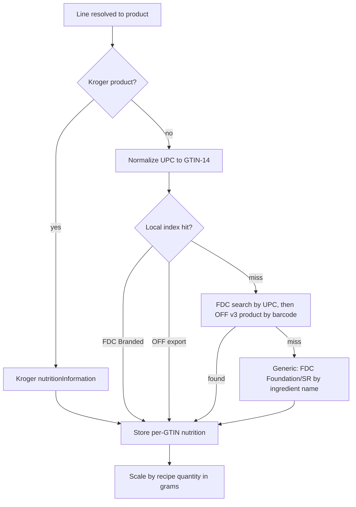

# 11: Automatic Nutrition from the Selected Product

Status: TODO
Owner repo: `amminox` (branch `feature/product-nutrition-gtin`)
Depends on: 02 (product payload with `upc`); 03 or 04 for real product ids. Tiers 2-3 can start immediately.
Skills: `backend-implementation`

## Goal

When a grocery line resolves to a real product, Carte fills in that ingredient's calories and macros automatically from label data keyed by the product's barcode. The user never types nutrition. Values are never fabricated (existing honesty rule in `server/src/nutritionEnrichment.js`).

## Context

`server/src/nutritionEnrichment.js` already enriches ingredients from USDA FDC (`USDA_API_KEY`, serialized one call per interval) and Open Food Facts search, per 100 g, source-stamped, never fabricated, never overwriting recipe values. It matches by ingredient **name**. This task adds matching by **product barcode** once tasks 03/04 attach a real product to each line.

## Constraints

- FDC API: 1,000 requests/hour/IP; exceeding blocks the key for 1 hour. The bulk import makes the API a rare fallback.
- OFF: 15 product reads/min/IP, 10 searches/min/IP; custom `User-Agent: Carte/<version> (<contact>)` required; ODbL attribution and share-alike apply to the derived OFF rows (keep them in a separable `source='off'` partition and attribute in the UI).
- FDC data is CC0; cite "U.S. Department of Agriculture, Agricultural Research Service. FoodData Central" on the nutrition screen.
- The import CronJob declares resource requests/limits and runs in `dev` first. Bulk files are streamed, not loaded into memory.

## Findings (Verified against vendor docs unless noted)

| Source | Barcode available? | Nutrition available? | Notes |
|---|---|---|---|
| Walmart Affiliate Search / Lookup | **Yes**, `upc` on every item in the [Search](https://walmart.io/docs/affiliates/v1/search) and [Product Lookup](https://walmart.io/docs/affiliates/v1/product-lookup) samples; Lookup also accepts `upc=` / `gtin=` | **No.** The [Full Response group](https://walmart.io/docs/affiliates/v1/item-response-groups) has no nutrition fields (only descriptions, `size`, free-form `attributes`) | Check `attributes` for serving/nutrition keys in task 01 before ruling it out |
| Kroger Products API 1.3.0 | **Yes**, `upc` / 13-digit `productId` ("If converting from a barcode omit the check digit") | **Yes**, product details returns `nutritionInformation`, plus `allergens`, `allergensDescription` ([Products API](https://developer.kroger.com/api-products/api/product-api-public)) | Verify whether search results include it or only `GET /v1/products/{id}` |
| USDA FDC Branded Foods | Keyed by `gtinUpc` | Yes: label nutrients, `servingSize`/`servingSizeUnit`, `householdServingFullText`, per-100 g `foodNutrients` | Monthly updates, CC0, 1,000 req/h/IP; [bulk download](https://fdc.nal.usda.gov/download-datasets) |
| Open Food Facts | Keyed by barcode | Yes, `nutriments` per 100 g and per serving; crowd-sourced, variable quality | 15 reads/min/IP; daily exports; ODbL |
| Loose produce (tomato each, bananas) | Walmart/Kroger may return an internal or PLU-like code, not a GTIN | No label | Falls back to FDC Foundation / SR Legacy by ingredient name (current behavior) |

Answer to "can we cross-reference the Walmart UPC with USDA": yes. Walmart gives the UPC, and FDC Branded Foods and Open Food Facts both key nutrition by it. The work is barcode normalization and a local index so we don't burn rate limits.

## Design: resolve once per barcode, share across all users

1. **Tier 1, retailer-provided (Kroger).** Map `nutritionInformation` when present. Zero extra calls: it comes with the product lookup we already make.
2. **Tier 2, local GTIN index (primary for Walmart).**
   - Monthly CronJob (K8s, `dev`/`prod`) downloads the FDC Branded Foods bulk file and loads `product_nutrition (gtin14 PK, source, source_id, serving_size, serving_unit, household_serving, kcal_100g, protein_100g, carbs_100g, fat_100g, fiber_100g, sugar_100g, sodium_mg_100g, label_json, source_updated_at, fetched_at)`.
   - Optionally load the OFF daily delta export for US products into the same table with `source='off'`. FDC wins on conflict because it comes from manufacturer labels.
   - Lookups become an indexed SELECT: no rate limits, no latency, works in `virt`.
3. **Tier 3, on-demand API fallback** for GTINs missing locally: FDC `POST /foods/search {query: <gtin variants>, dataType: ["Branded"]}` and accept only an exact `gtinUpc` match; then OFF `GET /api/v3/product/<barcode>` (by-barcode read, not the 10/min search endpoint the current `fetchOffNutrition` uses). Write hits into `product_nutrition`; record misses with `negative_until` (7 days) so they are not re-queried.
4. **Tier 4, generic ingredient fallback** (existing `nutritionEnrichment.js`, name-based FDC/OFF) for produce and unmatched items, stamped `source='usda-generic'` so the UI can say "typical values".

### Barcode normalization (the part that usually breaks)

- Store everything as **GTIN-14**: digits only, left-pad with zeros to 14.
- Walmart `upc` is usually UPC-A (12 digits, with check digit): pad to 14.
- Kroger `productId`/`upc` is 13 digits **without** the check digit: compute the GS1 mod-10 check digit, append, then pad to 14.
- FDC `gtinUpc` varies (12/13/14 digits, sometimes missing leading zeros): normalize on import; if the check digit fails validation, index both "as-is padded" and "check digit appended" forms.
- UPC-E (8 digits) expands to UPC-A before padding.
- Unit-test every rule with real samples from each source.

### Turning label data into recipe nutrition

- Nutrition follows the **amount the recipe uses**, not the package bought. The product only makes the match brand-accurate.
- Convert the recipe quantity to grams: mass units directly; volume units via the FDC branded `servingSize` + `householdServingFullText` pair when both exist (for example "1 cup = 240 mL" or "2 tbsp = 32 g"), else FDC Foundation `foodPortions` densities, else leave unset.
- Count units ("2 tomatoes"): the FDC Foundation portion weight for the food, else unset.
- Persist `nutrition_source` + `gtin` + `captured_at` per recipe ingredient. Never overwrite user-entered or recipe-provided values (existing rule).

### When it runs

- During shop resolution (`shop.js` detached worker), right after a product is selected or swapped. Result is cached per GTIN, so the second user, or the second recipe with the same product, costs nothing.
- Swap in task 08 re-runs only the changed line.
- Nightly job refreshes rows older than 90 days for GTINs used in the last 30 days.

## Steps

1. `server/src/nutrition/gtin.js` (normalize, check digit, UPC-E expand) + tests.
2. Migration: `product_nutrition`, `product_nutrition_miss`; add `gtin`, `nutrition_source`, `captured_at` to recipe ingredient nutrition storage.
3. Importer `server/src/scripts/importFdcBranded.js` (streaming parse of the bulk JSON/CSV; batch upserts) + K8s CronJob manifest (probes N/A for Jobs; set resource limits) + a virt fixture subset for tests.
4. Kroger `nutritionInformation` mapper (in the task 04 provider).
5. API fallback tier with negative caching; switch OFF to by-barcode v3 reads with the required `User-Agent`.
6. Quantity-to-grams converter using serving and portion data; wire into the shop worker.
7. UI: nutrition badge per line with its source ("From label (USDA)", "From Kroger", "Typical values (USDA)", "Not available"); source attribution for FDC and OFF on the nutrition screen (OFF ODbL requirement).
8. Tests: sociable tests for each tier and fallthrough, normalization edge cases, no-fabrication (miss stays null), rate-limit (429) handling from virt.

## Acceptance criteria

- Resolving a Walmart shop in `virt` fills nutrition for branded items from the local index with no outbound calls.
- A Kroger product uses `nutritionInformation` without FDC/OFF calls.
- Loose produce falls back to generic values labelled as typical.
- A product with no match anywhere shows "Not available", never zero.

## Evidence to report

Normalization test table (sample barcodes from Walmart, Kroger, FDC), import job log (row counts, duration), hit-rate per tier over one test shop, and screenshots of the per-line nutrition badges.

## Do not

- Do not scrape nutrition from walmart.com product pages.
- Do not estimate nutrition with an LLM or heuristics and present it as label data.
- Do not call OFF search for per-item lookups (10 req/min limit); use by-barcode reads or the export.

## Log
